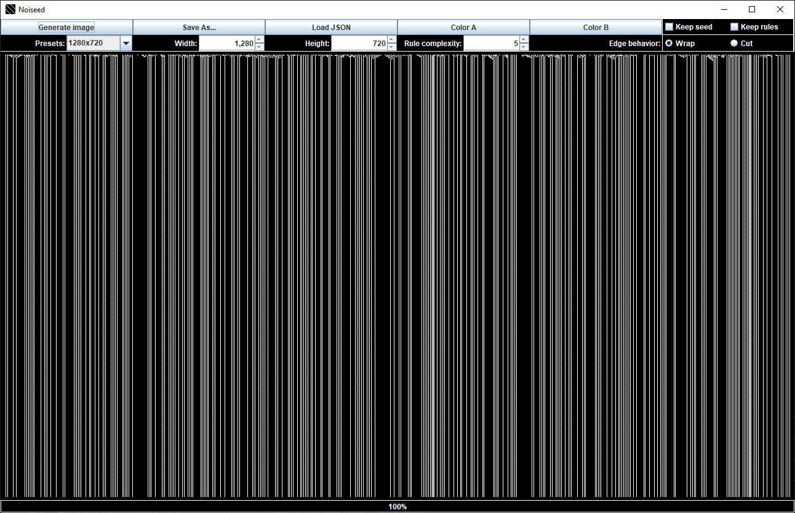

# Noiseed

Generate images where each pixel depends on a rule.
The rule is selected according to the **n** pixels in the row "above" the pixel.

Images look like noise for "big" **n** and often contain structure for "small" **n**.

Inspired by [Conway's Game of Life](https://en.wikipedia.org/wiki/Conway's_Game_of_Life).

---

### Example for n = 2

~~~
rules = {0:0, 1:0, 2:1, 3:0}
~~~

|       | ...   | col j-1 | col j | col j+1 | ...
| ---   | :---: | :---:   | :---: | :---:   | :---:
row i-1 | ...   | 0       | [1    | 0]      | ...
row i   | ...   | 0       | {x}   | ...     | ...

The window [MSB | LSB] above **x** is **10** in binary and **2** in decimal.

So the entry for **x** is determined by the *value* associated with the *key* **2** in rules.

Therefore **x = 1**.

---

### Example for n = 3

~~~
rules = {0:1, 1:1, 2:1, 3:1, 4:1, 5:1, 6:1, 7:0}
~~~

|       | ...   | col j-1 | col j | col j+1 | ...
| ---   | :---: | :---:   | :---: | :---:   | :---:
row i-1 | 0     | [1      | 1     | 1]      | ...
row i   | ...   | 1       | {x}   | ...     | ...

The window [MSB | ... | LSB] above **x** is **111** in binary and **7** in decimal.

So the entry for **x** is determined by the *value* associated with the *key* **7** in rules.

Therefore **x = 0**.

---

## Interface

## Examples of generated images

## Shortcuts 

- (G) Generate Image
- (S) Save As...
- (E) Load JSON
- (D) Choose a new "Color A"
- (F) Choose a new "Color B"
- (W) Toggle "Keep seed"
- (R) Toggle "Keep rules"
- (LEFT/RIGHT) Decrease/increase width
- (DOWN/UP) Decrease/increase height
- (A/Q) Decrease/increase rule complexity n

## Features

- Save the generated image in available file formats (e.g., image.png)
    - Associated seed and rules automatically saved under filename_info as JSON file (e.g., image_info.json)
- Load seed and rules from JSON file to regenerate associated image
- Alter the primary and secondary color
- Adjust image width and height
- Adjust rule complexity n
- Select standard sizes from presets
- Keep current seed for next image generation
- Keep current rules for next image generation
- 2 different edge behavior modes (wrap and cut)

## Known Issues

- Shortcuts can be pressed during color change and are executed after the color has changed
- No progress bar for color changes
- Missed opportunity to call the project "noisy drools" (noise, seed, rules)

## Dependency

[org.json](https://github.com/stleary/JSON-java)